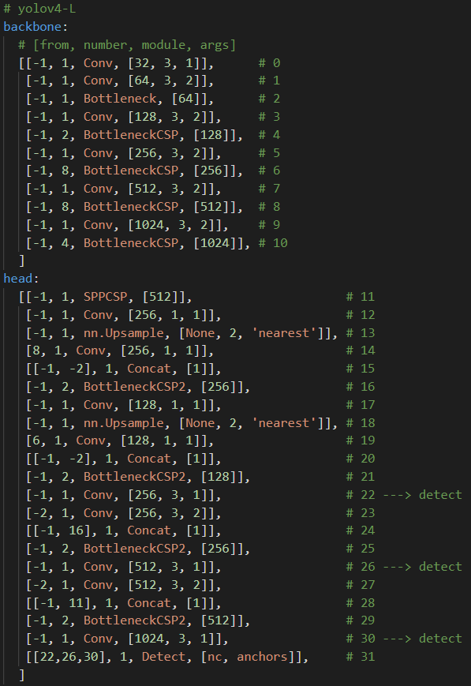

# Yolo_v4L_mish yaml to torchviz Block Diagram  
## 目的:
### Yolo 的 yaml 不容易理解，最好以方塊結構圖(block-diagram)表示，過程可以使用 torchviz 或是 Netron 將 yaml 可視化，可以更清楚瞭解 Yolov4 的整體架構。  

## Yolo_v4L_mish.yaml 架構:

***
## Yolo_v4L_mish torchviz Visualization:
### 檔案很大，載入需要時間...

***
# Block Diagram
### 製作中
