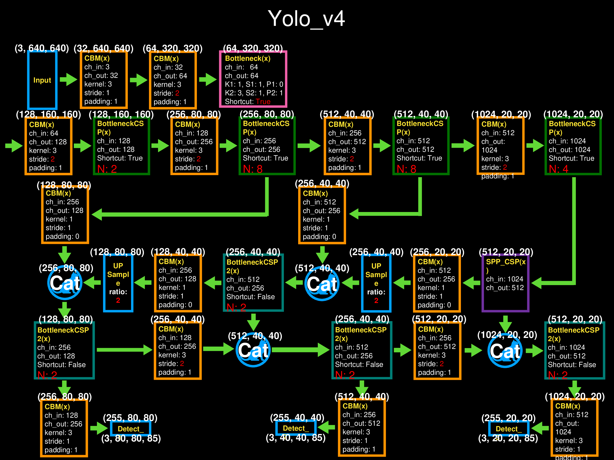

# Yolo_v4L_mish yaml to torchviz Block Diagram  
## 目的:
### Yolo 的 yaml 不容易理解，最好以方塊結構圖(block-diagram)表示，可以使用 torchviz 或是 Netron 將 Yolov4 可視化，可以更清楚瞭解 Yolov4 的整體架構。個人比較喜歡用 torchviz 將每個基本單元顯示出來，看看圖片(3,640,640)經過各單元後的維度與尺寸變化。  
### Netron 需要 .pt / .pth / .onnx 等等模型檔案，torchviz 則是加入幾行程式即可轉成 pdf 檔案:
    from torch.autograd import Variable
    from torchviz import make_dot
    
    img = Variable(torch.randn(1, 3, 640, 640))
    out=model(img) #out is a list with length: 3
    vizshow=make_dot(out[0], params=dict(model.named_parameters()))
    #vizshow=make_dot(out[1], params=dict(model.named_parameters()))
    #vizshow=make_dot(out[2], params=dict(model.named_parameters()))
    vizshow.view()
## Yolo_v4L_mish.yaml 架構:

***
## Torchviz 可視化:
### 注: 檔案很大，載入需要時間...請稍候

***
# Block Diagram
### 雖然網路上很多 Yolo_v4 方塊結構圖，個人比較喜歡 BaiYong 的版本，看起來會比較像從 Yolo_v3 改上來的，比較容易看的出來 v4 和 v3 的差異。

***
### 不過我又稍加重新製作一份，藉此更了解Yolo_v4的架構，也觀察尺寸的變化。
  

  

  

